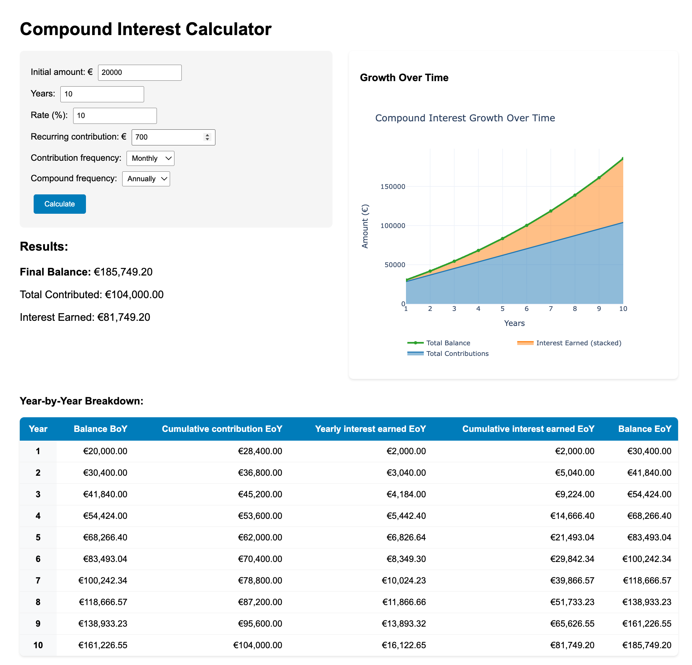

# Compound Interest Calculator

A web-based compound interest calculator built with Flask and Plotly that helps you visualize how your investments grow over time.

## Features

- 💰 **Interactive Calculator**: Calculate compound interest with customizable parameters
- 📊 **Visual Charts**: Interactive Plotly graphs showing growth over time
- 📋 **Detailed Breakdown**: Year-by-year table showing balance progression
- 🎛️ **Flexible Options**: 
  - Separate compound and contribution frequencies
  - Annual or monthly compounding
# Compound Interest Calculator

A small Flask web app that visualises investment growth using Plotly.

This README is concise and focused. It explains how to run the app for local development (virtualenv + `run_dev.py`) and how to run it in Docker for production (Gunicorn).

## Features

- Interactive compound interest calculator
- Plotly chart showing growth over time
- Year-by-year breakdown table
- Configurable contribution and compounding frequencies
- Euro (€) currency formatting

## The app in action



Screenshot of the calculator UI (form, chart and breakdown table).

## Prerequisites

- Python 3.11+ (tested with 3.13)
- pip
- For Docker deployment: Docker and Docker Compose (optional)

## Quick start — Local development

1. Clone the repo and create a virtual environment:

```bash
git clone https://github.com/osomike/compound_interest_calculator.git
cd compound_interest_calculator
python3 -m venv .venv
source .venv/bin/activate
```

2. Install dependencies:

```bash
pip install -r requirements.txt
```

3. Start the dev server (uses `run_dev.py`):

```bash
python run_dev.py
```

The dev server runs on port 5001 by default. Open http://127.0.0.1:5001 in your browser.

Notes:
- `run_dev.py` imports the Flask app from `app/app.py` and runs it with Flask's debug server.
- Use this mode for development only. For production, see the Docker / Gunicorn section below.

## Production — Docker + Gunicorn

This project includes a Dockerfile and `docker-compose.yml` for containerised deployment. The production image uses Gunicorn to serve the Flask app.


Build and run with Docker Compose (recommended):

```bash
docker compose up --build
```

Note: the included `docker-compose.yml` maps the container's port `5000` to host port `5001` (host:container -> `5001:5000`). When you use `docker compose up --build` open:

```
http://localhost:5001
```

Or, if you build and run the image directly and map ports yourself, the container exposes port `5000`:

```bash
docker build -t compound-interest-calculator .
docker run -p 5000:5000 compound-interest-calculator
```

When running the container directly (example above) open:

```
http://localhost:5000
```

Production notes:
- The Dockerfile runs Gunicorn to serve `app.app:app` (the Flask app object in `app/app.py`).
- Use an external reverse proxy (nginx) and environment variables for real deployments.

## Project structure

```
compound_interest_calculator/
├── Dockerfile
├── docker-compose.yml
├── requirements.txt       # Python dependencies
├── run_dev.py             # Run Flask dev server (uses app/app.py)
├── app/
│   └── app.py             # Flask app and Plotly template
├── images/                # Screenshot(s)
│   └── img_01.png
└── README.md
```

## Usage

1. Open the app in your browser.
2. Fill the form:
   - Initial amount (EUR)
   - Years
   - Annual rate (%)
   - Recurring contribution
   - Contribution frequency (Annual/Monthly)
   - Compound frequency (Annual/Monthly)
3. Click Calculate to see:
   - Final balance, total contributed and interest earned
   - Interactive Plotly chart
   - Year-by-year breakdown table

## Development notes

- The main Flask app lives in `app/app.py` and uses an inline HTML template with Plotly included via CDN.
- `run_dev.py` runs the app locally on port 5001 for development with debug enabled.
- `requirements.txt` pins `flask`, `plotly`, and `gunicorn`.
